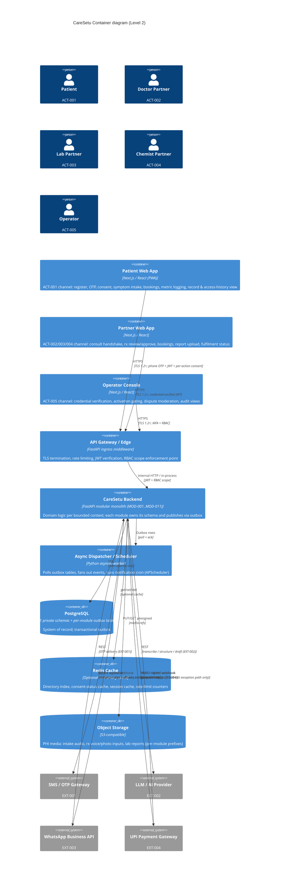

# Internal Module Architecture Document (Whitebox View)

**System Name:** CareSetu Platform
**Document Version:** 1.0 (Baseline)
**Date:** 2026-08-07
**Lead Architect:** Engineering / Architecture (derived from System Context v1.0 & PRD v1.0)
**Upstream Inputs:** System Context & External Architecture v1.0 (`ACT-001`–`ACT-005`, `EXT-001`–`EXT-004`) | PRD v1.0 (`FEAT-001`–`FEAT-020`, `NFR-001`–`NFR-004`, `NFR-D01`, `NFR-D02`)

---

## 1. Architectural Strategy & Decomposition Style

**Strategy: Modular Monolith with Event-Driven Seams** (single FastAPI deployable, one PostgreSQL instance, one async worker process). The dominant constraint is `NFR-001` (total monthly operating + hosting + AI spend ≤ ₹2,000) - microservices or managed brokers would multiply hosting cost and violate the cost floor. Instead, the monolith preserves **strict module isolation** so it can be re-cut into services later without redesign, while running today on a single VM + single Postgres + optional Redis.

**Core design principles:**

- **Bounded-Context Modularity (DDD).** Eleven modules (`MOD-001`–`MOD-011`), each mapped to one bounded context and one aggregate root family. Each module owns its business logic and its state transitions; no shared services layer that bleeds state between contexts.
- **Database-per-Module Isolation.** One physical PostgreSQL instance, **eleven private schemas**. No module ever queries another module's tables; all cross-module data access flows through the module's **public facade (sync API)** or the **event bus (async)**. The isolation rule is the module's schema + a CI-enforced dependency rule (no cross-schema imports / no foreign keys across schemas).
- **Transactional Outbox for Async.** Every module publishes events by writing to its own outbox table **in the same DB transaction** as the state change. The async dispatcher polls outboxes and fans out to subscribers. Delivery is **at-least-once**; every subscriber is idempotent (dedupe on `event_id`).
- **Clean / Hexagonal Boundaries.** Each module has a domain core (pure logic + state machines) and adapters (FastAPI routers, event handlers, external provider clients). Ports/interfaces are the only import paths a module may use to reach another module.
- **Cost-first Infrastructure.** No paid frameworks (`NFR-001`). PostgreSQL on the same VM; object storage (S3-compatible) for PHI media; Redis optional and replaceable by SQL-backed caches.
- **PHI minimisation & consent gating.** No module ever egresses PHI without a consent check against `MOD-004` and an audit append to `MOD-011` (`NFR-SEC-006`, `FEAT-002`, `FEAT-020`).

**Frontend strategy.** Three Next.js (React) channels - Patient Web App (PWA), Partner Web App, Operator Console - share one codebase / one deployment with role-scoped route groups to honour the ₹2,000 cost floor. They are containers (channels), not domain modules; all business state lives behind the backend modules.

**Explicitly carried forward / not claimed by any module (per blackbox §3.2 & PRD §3.2):**

- `REQ-026` lab-report baseline parsing - deferred; `FEAT-011` is filing-only.
- `REQ-038` ABHA integration, `REQ-039` monetization, `REQ-040` native/WhatsApp-first channels - out of scope (`[FUTURE]`).
- Open decisions `CFL-002/003/004`, `GAP-001/004/007/010/011/013`, `AMB-002/003/004/006` keep their PRD baseline assumptions; module behaviour is defined on those baselines and re-cut only when decided (see §5 note).

---

## 2. C4 Model - Level 2 & 3: Internal Container & Component Diagram

### 2.1 Level 2 - Container diagram

### 2.2 Level 3 - Backend component diagram

```mermaid
C4Component
  title CareSetu Backend components (Level 3)

  Container_Boundary(backend, "CareSetu Backend (FastAPI modular monolith)") {
    Component(gw, "API Gateway / Edge", "FastAPI middleware", "TLS, rate-limit (OTP/auth/intake), JWT verify, RBAC scope enforcement, request validation, upload scan trigger")
    Component(m1, "MOD-001 Identity & Access (IAM)", "FastAPI module", "FEAT-001; OTP, sessions, RBAC, credential accounts")
    Component(m2, "MOD-002 Partner Lifecycle & Directory", "FastAPI module", "FEAT-004/005/014/015; activation gating, directory")
    Component(m3, "MOD-003 Longitudinal Health Record", "FastAPI module", "FEAT-002(record)/003/018; chronic metrics, access history")
    Component(m4, "MOD-004 Consent & Access Control", "FastAPI module", "FEAT-002(consent)/020; consent lifecycle, egress authorization")
    Component(m5, "MOD-005 Intake & AI Orchestration", "FastAPI module", "FEAT-006/007/009(draft); EXT-002 orchestration, PHI-minimized egress")
    Component(m6, "MOD-006 Care Case & E-Prescription", "FastAPI module", "FEAT-008/009; handshake, rx lifecycle, doctor approval gate")
    Component(m7, "MOD-007 Diagnostics & Lab Reports", "FastAPI module", "FEAT-010/011; bookings, report match & file")
    Component(m8, "MOD-008 Pharmacy Fulfillment", "FastAPI module", "FEAT-012/013; routing, out-of-stock, delivery failure choices")
    Component(m9, "MOD-009 Settlement & Payments", "FastAPI module", "FEAT-016/017; outcome recording, UPI exception path")
    Component(m10, "MOD-010 Notifications", "FastAPI module", "FEAT-019; WhatsApp templates, in-app inbox, scheduling")
    Component(m11, "MOD-011 Audit", "FastAPI module", "FEAT-020(audit)/003; append-only hash chain, tamper detection")
    Component(dispatcher, "Async Dispatcher / Scheduler", "Python asyncio", "outbox consumers, idempotent fan-out, APScheduler cron")
  }
  ContainerDb(db, "PostgreSQL", "11 private schemas + outbox tables")
  ContainerDb(redis, "Redis Cache", "optional")
  ContainerDb(obj, "Object Storage", "S3-compatible PHI media")
  System_Ext(sms, "EXT-001 SMS/OTP")
  System_Ext(llm, "EXT-002 LLM/AI")
  System_Ext(wa, "EXT-003 WhatsApp")
  System_Ext(upi, "EXT-004 UPI GW")

  Rel(gw, m1, "validate_token / resolve_scope")
  Rel(m3, m4, "check_consent(patient, scope, counterparty)")
  Rel(m6, m5, "get_finalized_pre_summary")
  Rel(m6, m3, "read_consented_history")
  Rel(m8, m6, "get_approved_prescription")
  Rel(m7, m3, "get_consented_patient")
  Rel(m10, m1, "resolve_contact(phone, language)")
  Rel(m10, m6, "get_rx_schedule")
  Rel(m2, m1, "create_credential_account / activate role")
  Rel(m1, sms, "send OTP")
  Rel(m5, llm, "transcribe / structure / draft")
  Rel(m10, wa, "template send; receive signed callbacks")
  Rel(m9, upi, "initiate; receive HMAC webhooks")
  Rel(m1, db, "iam schema")
  Rel(m2, db, "partner schema")
  Rel(m3, db, "health schema")
  Rel(m4, db, "consent schema")
  Rel(m5, db, "intake schema")
  Rel(m6, db, "care schema")
  Rel(m7, db, "diagnostics schema")
  Rel(m8, db, "fulfillment schema")
  Rel(m9, db, "settlement schema")
  Rel(m10, db, "notify schema")
  Rel(m11, db, "audit schema")
  Rel(dispatcher, db, "poll outbox tables only; never authors events")
  Rel(m5, obj, "audio / photo refs")
  Rel(m7, obj, "report uploads")
  Rel(m6, obj, "doctor input media")
```

---

## 3. Internal Module Specifications

_(Each module owns its data, its schema, and its state transitions; cross-module access is only via the module facade (sync) or events (async).)_

---

### 3.1 Module: `MOD-001` Identity & Access (IAM)

- **Module ID:** `MOD-001`
- **Primary Scope:** Patient identity (phone-OTP registration, stable identity per phone, duplicate-resolution), OTP challenge lifecycle, session JWT issuance/validation, partner credential accounts, operator MFA, and the RBAC role/scope registry enforced at the edge.
- **Traceability Link:** `FEAT-001`, `FEAT-014`(accounts), `FEAT-015`(operator MFA), `FEAT-003`(RBAC), `NFR-SEC-002`, `NFR-SEC-003`, `NFR-SEC-004`, `EXT-001`

#### 1. Data Ownership & Storage Isolation

- **Storage Type:** Relational - PostgreSQL schema `iam`: `iam_identities` (phone_e164 unique, status, lockout_failed_attempts + lockout_until), `iam_otp_challenges` (OTP hashed, single-use, TTL 5 min, 5-attempt budget, cooldown), `iam_sessions` (jti, expiry, scope, refresh_token_hash + refresh_expires_at), `iam_role_grants` (patient/partner/operator), `iam_outbox`.
- **Caching Strategy:** Session/scope claims cached in Redis (TTL); OTP resend cooldown & brute-force counters in Redis (fallback to SQL counters if Redis absent).
- **Data Isolation Rule:** Private `iam` schema; no other module reads `iam` tables. Identity resolution, token validation, and role/scope checks are exported via the IAM facade only.

#### 2. Inbound & Outbound Interfaces

- **Inbound Sync APIs:** `register_patient(phone)`, `verify_otp(phone, otp)`, `resend_otp(phone)`, `issue_session`, `refresh_session`, `validate_token(jwt) → scope`, `resolve_identity(phone)`, `resolve_actor(actor_id)`, `create_credential_account(partner_id, type)`, `set_actor_status(actor_id, active|suspended)`.
- **Inbound Events Subscribed:** `partner.activated` (from `MOD-002` → activate partner role), `partner.rejected` (→ revoke/deny role).
- **Outbound Events Published:** `patient.registered`, `patient.verified`, `patient.auth_failed`, `otp.sent`, `otp.failed`.

#### 3. Core Business Logic & State Machines

- **Identity state machine:** `[Unverified] → [Active] → [Suspended]`; re-registration with existing phone resolves to the existing identity (never a duplicate - `FEAT-001` Rule 1, baseline `GAP-001`).
- **Phone normalization:** input is a 10-digit Indian mobile number, normalized server-side to E.164 `+91XXXXXXXXXX`; anything else is rejected with a clear validation error, the country code is derived server-side and never trusted from the client, and the canonical form is stored as `phone_e164` (unique).
- **OTP challenge machine:** `[Pending] → [Verified] | [Expired] | [Failed]`; single-use, 5-minute TTL, 5-attempt budget per challenge (a wrong guess decrements the budget but does not kill the code; the challenge is spent at 0 with a "request a new code" response), latest-wins resend (invalidates the pending challenge), in-app resend cooldown ≥ 60 s per phone measured from the last issuance, values hashed at rest and never logged.
- **Brute-force lockout (a counter, never identity state):** 10 consecutive verification failures across challenges → 15-minute temporary phone lockout, carried as the `lockout_failed_attempts` + `lockout_until` columns on `iam_identities` (never as the identity lifecycle status), enforced on `verify_otp`, `resend_otp`, and the existing-phone login branch of `register_patient` (a locked or cooldown-active phone is refused at the begin-or-resume entry, no fresh challenge issued and no SMS sent), reset by a successful verification or by the next failure once the window has fully elapsed (a failure after the lockout lifts starts a fresh streak). Distinct from the `Suspended` identity status, which stays reachable only via `set_actor_status` (Phase 5).
- **Session machine:** after successful verification the module issues an access JWT with a ~15-minute TTL carrying `jti`, expiry, and the scope claim, plus an opaque refresh token stored server-side with a ~30-day sliding lifetime, rotated on every refresh; the refresh path is fully independent of SMS. The refresh seam is backend-only: an internal rotation path with no HTTP route, no frontend consumer, and no lifecycle outbox event (its only outbox write is the `patient.auth_failed` replay audit). The seam stays backend-only because no consumer needs an HTTP refresh route in Phase 2 - exposing one would widen the auth attack surface for a caller that does not exist (PHASE-2 REM T10 #82).
- **Access-denial boundary:** a refusal on a protected route with an authenticated caller (403, insufficient scope or missing role) publishes `patient.auth_failed` (reason `access_denied`) to the iam outbox in its own transaction so the denial is auditable; an anonymous denial (401) has no identity to attribute and stays log-only - no outbox write (PHASE-2 REM T7 #87).
- **RBAC scope registry:** `patient`, `partner`, and `operator` scopes are reserved in the registry from Phase 2 so the edge has one source of truth for scope; only the `patient` scope is reachable in Phase 2 - no token is minted with `partner` or `operator` until the credential accounts (MOD-002, Phase 5) and operator MFA (Phase 5) exist.

#### 4. High-Level Tech Stack & Framework Constraints

- **Language/Runtime:** Python 3.11+ (asyncio).
- **Framework:** FastAPI + Pydantic v2 + SQLAlchemy 2.0 (async).
- **Persistence Layer:** PostgreSQL (`iam` schema); optional Redis for counters/cache; no paid frameworks (`NFR-001`).
- **External:** `EXT-001` SMS/OTP via server-side API key; outbound REST, ≤ 10 s timeout, 3 retries with backoff.

#### 5. Module NFR Allocation

- **Latency SLA:** `validate_token` p95 < 100 ms at the edge; `verify_otp` p95 < 400 ms (dominated by SMS best-effort).
- **Availability Target:** Best-effort (no uptime SLA per `NFR-004`); OTP outage never bricks existing sessions (refresh path independent of SMS).
- **Per-Module NFRs:** Rate-limit OTP/auth endpoints (`NFR-SEC-004`); 100% of consent/access acts traceable to an actor (feeds `KPI-006`).

---

### 3.2 Module: `MOD-002` Partner Lifecycle & Directory

- **Module ID:** `MOD-002`
- **Primary Scope:** Open partner registration, credential submission & verification gating (`REQ-028`), operator verification workflow, activation state, provider directory search/filter (distance, active-only), provider profiles & credential display with expiry/revocation deactivation.
- **Traceability Link:** `FEAT-004`, `FEAT-005`, `FEAT-014`, `FEAT-015`, `ACT-002/003/004/005`, `NFR-SEC-003`

#### 1. Data Ownership & Storage Isolation

- **Storage Type:** Relational - PostgreSQL schema `partner`: `partner_profiles` (type: doctor|lab|chemist), `partner_credentials` (registration/license refs, verified flag, expiry), `partner_verifications` (queue, status, decision), `directory_index` (geo, specialties, active flag), `service_areas`, `partner_outbox`.
- **Caching Strategy:** Directory index / search results cached in Redis (TTL, invalidated on activation/revocation); only **activated** partners appear in search (`FEAT-004` Rule 1, `REQ-028`).
- **Data Isolation Rule:** Private `partner` schema; directory reads by patients go through the `MOD-002` search facade, never direct SQL.

#### 2. Inbound & Outbound Interfaces

- **Inbound Sync APIs:** `register_partner(profile, credentials)`, `submit_credentials`, `list_verification_queue(operator)`, `operator_decision(partner, approve|reject)`, `search_directory(query, filters, geo)`, `get_provider_profile(partner)`, `invalidate_credential(partner, reason)`.
- **Inbound Events Subscribed:** (none external; driven by sync calls from operator/partner channels).
- **Outbound Events Published:** `partner.registered`, `partner.verification_started`, `partner.activated`, `partner.rejected`, `credential.invalidated`, `directory_search` (analytics).

#### 3. Core Business Logic & State Machines

- **Partner lifecycle machine:** `[Registered] → [Under Verification] → [Active] | [Rejected]`; `[Active] → [Credential Revoked] → [Inactive]` on expiry/revocation (`FEAT-005`, `FEAT-014`).
- **Verification logic:** automated checks with manual review for flagged cases (baseline `AMB-003`); queue prioritised by registration age (`KPI-004`).

#### 4. High-Level Tech Stack & Framework Constraints

- **Language/Runtime:** Python 3.11+ (asyncio).
- **Framework:** FastAPI + Pydantic v2 + SQLAlchemy 2.0 (async).
- **Persistence Layer:** PostgreSQL (`partner` schema); Redis for search index.
- **Constraint:** Geospatial search within Daltonganj + peri-urban scope (`REQ-008`) - PostGIS optional, SQL range/point fallback at cost floor.

#### 5. Module NFR Allocation

- **Latency SLA:** Directory search p95 < 250 ms (cached); profile view p95 < 200 ms.
- **Availability Target:** Best-effort (`NFR-004`).
- **Per-Module NFRs:** Activation-cycle target ≤ 48 h median (`KPI-004`); every `approve`/`reject` decision audited (`FEAT-015`, `FEAT-020`).

---

### 3.3 Module: `MOD-003` Longitudinal Health Record (LHR)

- **Module ID:** `MOD-003`
- **Primary Scope:** The patient's single longitudinal record - record entries, chronic metric logging (BP/sugar), follow-up plans, record access history, and the patient's own-record view (`FEAT-003`). It stores but never _shares_: all sharing is consent-gated via `MOD-004`.
- **Traceability Link:** `FEAT-002`(record), `FEAT-003`, `FEAT-018`(metrics), `NFR-002`, `NFR-004`, `REQ-021`

#### 1. Data Ownership & Storage Isolation

- **Storage Type:** Relational - PostgreSQL schema `health`: `patient_records`, `record_entries` (clinical entries attached from other modules via events), `chronic_metrics` (bp/sugar, timestamp, out-of-range flag), `follow_up_plans`, `record_access_history`; PHI media refs point into object storage (owned prefixes).
- **Caching Strategy:** Read-heavy own-record views cached in Redis; record-access gating cached via `MOD-004` consent status.
- **Data Isolation Rule:** Private `health` schema; the ONLY legal readers are the record owner (`FEAT-003` Rule 1) or a partner with a live consent grant checked against `MOD-004`; never queried directly by other modules.

#### 2. Inbound & Outbound Interfaces

- **Inbound Sync APIs:** `create_record(patient_id)`, `get_own_record(patient_id)`, `get_access_history(patient_id)`, `log_metric(patient_id, type, value)`, `read_consented_history(patient_id, scope, counterparty, consent_token)`, `get_follow_up_plan(patient_id)`.
- **Inbound Events Subscribed:** `patient.registered` (create shell), `consent.granted/revoked` (update effective sharing scope), `report.filed`, `prescription.issued`, `prescription.delivered`, `metric.logged` (self), `settlement.recorded` (attach to record).
- **Outbound Events Published:** `record.accessed`, `metric.logged`, `metric_out_of_range`, `follow_up.due` (to scheduler / `MOD-010`).

#### 3. Core Business Logic & State Machines

- **Metric log machine:** `[Log: Due] → [Log: Recorded] → [Log: Acknowledged in Loop]`; out-of-range values stored and surfaced, **no automated clinical action** (`REQ-033`).
- **Record lifecycle:** record created on `patient.registered`; retained for account life (deletion/retention open `GAP-005`/`GAP-013`, operator-mediated).

#### 4. High-Level Tech Stack & Framework Constraints

- **Language/Runtime:** Python 3.11+ (asyncio).
- **Framework:** FastAPI + Pydantic v2 + SQLAlchemy 2.0 (async).
- **Persistence Layer:** PostgreSQL (`health` schema); object storage for attachments.

#### 5. Module NFR Allocation

- **Latency SLA:** Own-record view p95 < 250 ms; `read_consented_history` p95 < 300 ms (includes consent check).
- **Availability Target:** Best-effort (`NFR-004`); **durability floor applies here** - daily backup (RPO ≤ 24 h), monthly restore validation (`GAP-012`).
- **Per-Module NFRs:** 100% of record accesses logged (`KPI-006`); only owner/consented-partner reads (RBAC + consent, `NFR-002`).

---

### 3.4 Module: `MOD-004` Consent & Access Control

- **Module ID:** `MOD-004`
- **Primary Scope:** The consent registry and per-action consent lifecycle - request, grant, revoke, versioning - plus the **egress authorization gate**: any PHI share or egress (to partners or to `EXT-002`) is authorised only with a live recorded consent, and every authorization is logged.
- **Traceability Link:** `FEAT-002`(consent), `FEAT-020`(consent lifecycle), `NFR-SEC-006`, `NFR-D02`, `NFR-002`, `KPI-006`

#### 1. Data Ownership & Storage Isolation

- **Storage Type:** Relational - PostgreSQL schema `consent`: `consents` (patient_id, counterparty_type/id, record_scope, status, version), `consent_events` (requested/granted/revoked), `egress_log` (what PHI left the boundary, when, to whom, via which action).
- **Caching Strategy:** Consent-status cache in Redis (keyed patient+scope+counterparty), invalidated on grant/revoke; revocation is immediately effective.
- **Data Isolation Rule:** Private `consent` schema; no module reads consent tables directly - they call `check_consent()`. `MOD-003` and `MOD-005` MUST pass a live consent before any share/egress (`NFR-SEC-006`).

#### 2. Inbound & Outbound Interfaces

- **Inbound Sync APIs:** `request_consent(patient, counterparty, scope)`, `grant_consent`, `revoke_consent`, `check_consent(patient, scope, counterparty) → allowed:bool, consent_id, scope`, `list_consents(patient)`, `list_egress_log(patient)`.
- **Inbound Events Subscribed:** `patient.registered` (create empty consent profile).
- **Outbound Events Published:** `consent.requested`, `consent.granted`, `consent.revoked`, `consent.egress_authorized` (→ `MOD-011` audit).

#### 3. Core Business Logic & State Machines

- **Consent machine:** `[Requested] → [Granted] → [Revoked]`; revocation stops all future sharing with the counterparty and is recorded (`FEAT-002` Rule / `NFR-COMP-002`); re-grant creates a new version (`NFR-D02` versioning, open `GAP-005`/`GAP-013`).
- **Egress rule:** `check_consent()` is evaluated on every share and every LLM egress; a denial short-circuits the requesting module.

#### 4. High-Level Tech Stack & Framework Constraints

- **Language/Runtime:** Python 3.11+ (asyncio).
- **Framework:** FastAPI + Pydantic v2 + SQLAlchemy 2.0 (async).
- **Persistence Layer:** PostgreSQL (`consent` schema); Redis consent cache.

#### 5. Module NFR Allocation

- **Latency SLA:** `check_consent` p95 < 50 ms (hot path called by every share).
- **Availability Target:** Best-effort; revocation must be durably written before the grant is treated as inactive.
- **Per-Module NFRs:** 100% of consent actions recorded (`KPI-006`); consent lifecycle per DPDP baseline (open `GAP-005`/`GAP-013`).

---

### 3.5 Module: `MOD-005` Intake & AI Orchestration

- **Module ID:** `MOD-005`
- **Primary Scope:** Symptom intake capture (voice + text, English + Hindi), upload resilience, LLM orchestration (transcribe → structure → clinical pre-summary), AI e-prescription drafting input, low-confidence fallback, and **PHI-minimized, consent-gated, budget-metered** egress to `EXT-002`.
- **Traceability Link:** `FEAT-006`, `FEAT-007`, `FEAT-009`(draft), `EXT-002`, `NFR-001`, `NFR-PERF-002`, `NFR-PERF-003`, `NFR-SEC-006`, `AMB-006`

#### 1. Data Ownership & Storage Isolation

- **Storage Type:** Relational - PostgreSQL schema `intake`: `intakes` (mode voice|text, language, status), `pre_summaries` (structured fields, confidence, review state), `ai_jobs` (provider, tokens, ₹cost, status), `media_refs`; audio/photos in object storage under `intake/` and `rx_input/` prefixes.
- **Caching Strategy:** Pre-summaries cached for doctor view; AI cost meter counters in Redis (persisted to `ai_jobs`).
- **Data Isolation Rule:** Private `intake` schema; other modules read pre-summaries only via the facade.

#### 2. Inbound & Outbound Interfaces

- **Inbound Sync APIs:** `submit_intake(patient, mode, language, media|text)`, `get_intake`, `get_pre_summary(intake_id)`, `mark_pre_summary_reviewed(intake_id, doctor)`, `request_rx_draft(doctor_input_ref, pre_summary_ref, history_summary)`.
- **Inbound Events Subscribed:** `intake.captured` (self-trigger → async AI pipeline).
- **Outbound Events Published:** `intake.captured`, `pre_summary.ready`, `pre_summary.low_confidence`, `ai_job.completed`, `ai_job.failed`, `ai_egress.recorded`.

#### 3. Core Business Logic & State Machines

- **Intake machine:** `[Captured] → [Structuring] → [Ready for Review] | [Re-record]` (poor/too-short audio prompts re-record, never silent proceed - `FEAT-006`, `NFR-PERF-002`).
- **Pre-summary machine:** `[Draft] → [Reviewed] → [Final]`; low confidence (< threshold, `AMB-006`) forces `[Review required]` - flagged "low confidence - verify" and never presented as verified (`FEAT-007`).
- **LLM degradation:** ≤ 30 s timeout, 3 retries with backoff; on timeout/failure/low confidence → degrade to forced doctor review; external failure never blocks the care loop (`NFR-PERF-003`).

#### 4. High-Level Tech Stack & Framework Constraints

- **Language/Runtime:** Python 3.11+ (asyncio).
- **Framework:** FastAPI + Pydantic v2; `httpx` for LLM calls.
- **Persistence Layer:** PostgreSQL (`intake` schema); object storage for media.
- **Constraint:** `EXT-002` freemium tier; hard token/₹ budget meter enforced (`NFR-001`, `NFR-COST-001`); egress carries only intake/prescription context - never the full record (`NFR-SEC-006`).

#### 5. Module NFR Allocation

- **Latency SLA:** Capture ack p95 < 2 s (upload resilience ≥ 1 Mbps, 3 auto-retries); LLM call p95 ≤ 30 s (async, never in user-critical path).
- **Availability Target:** Best-effort; AI pipeline failure degrades to doctor-review path, never blocks intake.
- **Per-Module NFRs:** AI spend metered to `NFR-001` budget; every LLM egress consent-gated + audited (`KPI-006`).

---

### 3.6 Module: `MOD-006` Care Case & E-Prescription

- **Module ID:** `MOD-006`
- **Primary Scope:** The consult orchestration handshake (doctor-initiated baseline `CFL-003`), case stage machine, e-prescription lifecycle (AI draft → doctor review/edits → approval gate → issued), and the **hard rule that no prescription is ever issued without doctor approval** (`REQ-023`).
- **Traceability Link:** `FEAT-008`, `FEAT-009`, `ACT-002`, `EXT-002`(draft via `MOD-005`), `NFR-SEC-003`, `RISK-EVAL-003`/`CFL-002`

#### 1. Data Ownership & Storage Isolation

- **Storage Type:** Relational - PostgreSQL schema `care`: `cases` (patient, doctor, stage), `prescriptions` (status, issued_at, attributed_doctor), `rx_items` (name, dose, duration), `rx_approvals` (doctor_id, edited_yn, decision, reason), `doctor_inputs` (voice_note/photo refs); doctor input media in object storage.
- **Caching Strategy:** Doctor's pending-cases list cached in Redis; prescription (post-approval) cached for fulfilment read.
- **Data Isolation Rule:** Private `care` schema; `MOD-008` reads approved prescriptions via the facade.

#### 2. Inbound & Outbound Interfaces

- **Inbound Sync APIs:** `mark_consult_complete(doctor, case)`, `get_case`, `list_doctor_cases(doctor)`, `submit_doctor_input(case, voice|photo)`, `approve_prescription(case, edits?)`, `reject_prescription(case, reason)`, `get_approved_prescription(rx_id)`.
- **Inbound Events Subscribed:** `pre_summary.ready` (attach summary to case), `pre_summary.low_confidence` (flag for forced review before handshake), `report.filed` (attach to case context).
- **Outbound Events Published:** `case.consult_complete`, `prescription.draft_created`, `prescription.approved`, `prescription.rejected`, `prescription.issued`.

#### 3. Core Business Logic & State Machines

- **Case machine:** `[Case: Pre-Summary] → [Case: Consult Complete] → [Case: Prescription Pending]`; handshake **requires a finalized pre-summary** (`FEAT-008` edge case).
- **Prescription machine:** `[Rx: Draft] → [Rx: Doctor Reviewed] → [Rx: Approved & Issued] → [Rx: Fulfilled]` with branch `[Rx: Rejected]`; edits recorded via `edited_yn` (`FEAT-009`).

#### 4. High-Level Tech Stack & Framework Constraints

- **Language/Runtime:** Python 3.11+ (asyncio).
- **Framework:** FastAPI + Pydantic v2 + SQLAlchemy 2.0 (async).
- **Persistence Layer:** PostgreSQL (`care` schema); object storage for doctor inputs.
- **Constraint:** Draft comes from `MOD-005`; issuance authority stays with the licensed doctor (baseline `CFL-002`/`RISK-EVAL-003`).

#### 5. Module NFR Allocation

- **Latency SLA:** Handshake + stage transition p95 < 300 ms; approval submission p95 < 300 ms.
- **Availability Target:** Best-effort (`NFR-004`).
- **Per-Module NFRs:** Zero prescriptions issued without doctor approval (hard gate, `REQ-023`); every issuance/rejection audited (`FEAT-020`, `KPI-006`).

---

### 3.7 Module: `MOD-007` Diagnostics & Lab Reports

- **Module ID:** `MOD-007`
- **Primary Scope:** Diagnostics booking (home pickup / partner lab / direct fallback), sample pickup orchestration, lab report upload, **order-ID + patient matching before filing** (wrong-upload protection, `RISK-002`), and filing into the patient's record. Filing only - no baseline parsing (`REQ-026` deferred).
- **Traceability Link:** `FEAT-010`, `FEAT-011`, `ACT-001`, `ACT-003`, `NFR-SEC-004`, `RISK-002`, `GAP-004`/`GAP-008`

#### 1. Data Ownership & Storage Isolation

- **Storage Type:** Relational - PostgreSQL schema `diagnostics`: `diagnostic_orders` (patient, lab, mode, state), `sample_pickups`, `lab_reports` (status, matched, filed), `report_uploads` (uploader_type lab|patient, checksums), `upload_matches` (match_method); report files in object storage under `reports/` (scan before filing).
- **Caching Strategy:** Pending-order lists for labs; report status cached.
- **Data Isolation Rule:** Private `diagnostics` schema; filed reports are handed to `MOD-003` via event, never written into `health` directly by `MOD-007`.

#### 2. Inbound & Outbound Interfaces

- **Inbound Sync APIs:** `book_diagnostic(patient, lab, mode)`, `confirm_pickup(order)`, `collect_sample(order)`, `upload_report(order, uploader, file)`, `confirm_report_match(order, patient_confirmation)`, `get_order(order_id)`.
- **Inbound Events Subscribed:** (none external; driven by patient/lab channels).
- **Outbound Events Published:** `diagnostic.order_booked`, `sample.collected`, `report.uploaded`, `report.matched`, `report.filed`, `report.rejected_mismatch`, `diagnostic.fallback_used`.

#### 3. Core Business Logic & State Machines

- **Order machine:** `[Order: Booked] → [Order: Sample Collected] → [Order: Result Pending] → [Order: Result Filed]`; `[Booked] → [Cancelled]` (via `MOD-009`).
- **Report machine:** `[Report: Uploaded] → [Report: Matched] → [Report: Filed]` | `[Report: Rejected]` - matching = order-ID binding + patient confirmation (baseline `GAP-004`/`GAP-008`); a mismatch is rejected visibly and never filed (`FEAT-011`, `RISK-002`).

#### 4. High-Level Tech Stack & Framework Constraints

- **Language/Runtime:** Python 3.11+ (asyncio).
- **Framework:** FastAPI + Pydantic v2 + SQLAlchemy 2.0 (async).
- **Persistence Layer:** PostgreSQL (`diagnostics` schema); object storage for reports; upload scanning at the edge (`NFR-SEC-004`).
- **Constraint:** No critical-value escalation (`REQ-033`); no baseline parsing (`REQ-026`).

#### 5. Module NFR Allocation

- **Latency SLA:** Booking p95 < 300 ms; upload ack p95 < 2 s (resilient upload).
- **Availability Target:** Best-effort (`NFR-004`).
- **Per-Module NFRs:** **0 report mis-attachments** (`KPI-003`); every upload matched to order + patient before filing.

---

### 3.8 Module: `MOD-008` Pharmacy Fulfillment

- **Module ID:** `MOD-008`
- **Primary Scope:** Routing approved e-prescriptions to the patient's chosen/nearest chemist (`REQ-027`), zero-inventory fulfilment status tracking, out-of-stock & partial-fulfilment workflows, and delivery/pickup failure handling with patient choice.
- **Traceability Link:** `FEAT-012`, `FEAT-013`, `ACT-001`, `ACT-004`, `GAP-007`

#### 1. Data Ownership & Storage Isolation

- **Storage Type:** Relational - PostgreSQL schema `fulfillment`: `fulfillment_orders` (rx_id, chemist_id, route_basis, state), `fulfillment_events` (preparing/out_for_delivery/delivered), `out_of_stock_items` (item_ids), `patient_choices` (partial|cancel, off_platform|platform retry).
- **Caching Strategy:** Fulfilment status cache for patient/chemist status views.
- **Data Isolation Rule:** Private `fulfillment` schema; reads the approved prescription only via `MOD-006` facade.

#### 2. Inbound & Outbound Interfaces

- **Inbound Sync APIs:** `route_prescription(rx_id, chemist_id, basis)`, `update_fulfillment(order, status)`, `report_out_of_stock(order, item_ids)`, `record_patient_choice(order, choice)`, `report_delivery_failure(order, reason)`, `record_retry_path(order, path)`.
- **Inbound Events Subscribed:** `prescription.approved` (initiate routing).
- **Outbound Events Published:** `prescription.routed`, `order.preparing`, `order.out_for_delivery`, `order.delivered`, `out_of_stock.notified`, `patient_choice.partial`, `patient_choice.cancel`, `delivery.failure`, `retry_path.selected`.

#### 3. Core Business Logic & State Machines

- **Fulfilment machine:** `[Rx: Approved] → [Rx: Routed] → [Rx: Preparing] → [Rx: Out for Delivery] → [Rx: Delivered]`; from `[Preparing]` branch to `[Rx: Partial] | [Rx: Cancelled]` on out-of-stock; `[Delivery: Failed] → [Delivery: Off-Platform Retry] | [Delivery: Platform Retry]`.
- **Patient-choice rule:** patient is always notified and always chooses (`FEAT-013` Rule 1); no time-bound partner SLA (baseline `GAP-007`, latency measured for `KPI-008`).

#### 4. High-Level Tech Stack & Framework Constraints

- **Language/Runtime:** Python 3.11+ (asyncio).
- **Framework:** FastAPI + Pydantic v2 + SQLAlchemy 2.0 (async).
- **Persistence Layer:** PostgreSQL (`fulfillment` schema).

#### 5. Module NFR Allocation

- **Latency SLA:** Status update p95 < 200 ms; routing p95 < 300 ms.
- **Availability Target:** Best-effort (`NFR-004`).
- **Per-Module NFRs:** Fulfilment success rate tracked (`KPI-002`); every out-of-stock/delivery event notified to the patient.

---

### 3.9 Module: `MOD-009` Settlement & Payments

- **Module ID:** `MOD-009`
- **Primary Scope:** Recording settlement outcomes (cash/UPI direct - the primary path), the **platform-facilitated UPI exception** for fraud-risk cases (both parties opt-in + risk signal, baseline `AMB-004`/`CFL-001`), cancellation policy display & records, partner-direct refund records, and UPI webhook verification with idempotency. **Platform holds no funds and processes no refunds** (`REQ-036`).
- **Traceability Link:** `FEAT-016`, `FEAT-017`, `ACT-001`, `ACT-003`, `ACT-004`, `EXT-004`, `NFR-SEC-005`, `RISK-001`

#### 1. Data Ownership & Storage Isolation

- **Storage Type:** Relational - PostgreSQL schema `settlement`: `settlements` (order_ref, type cash|upi|platform_facilitated, amount_paise, status), `payment_intents` (idempotency_key, payment_ref, upi status), `webhook_events` (HMAC-verified, dedupe on payment_ref), `cancellations` (cancelled_by), `refund_records` (partner-direct), `cancellation_policies` (per partner/service).
- **Caching Strategy:** Cancellation policies cached (display at booking); settlement status cached.
- **Data Isolation Rule:** Private `settlement` schema; order context fetched from `MOD-006`/`MOD-007` facades.

#### 2. Inbound & Outbound Interfaces

- **Inbound Sync APIs:** `record_settlement(order, type, amount)`, `initiate_facilitated_payment(order, patient_upi, reason)`, `get_cancellation_policy(provider, service)`, `cancel_order(order, cancelled_by)`, `record_partner_refund(order)`.
- **Inbound Events Subscribed / Webhooks:** `EXT-004` UPI status webhook (HMAC-signed, idempotent replay-safe).
- **Outbound Events Published:** `settlement.recorded`, `platform_payment.initiated`, `payment.webhook_received`, `order.cancelled`, `refund.partner_direct`.

#### 3. Core Business Logic & State Machines

- **Settlement machine:** `[Settlement: Direct] | [Settlement: Platform-Facilitated] → [Settlement: Completed]`; facilitated path requires opt-in + risk signal (`FEAT-016` Scenario 2).
- **Payment-intent machine:** `[Initiated] → [Success] | [Failed] → [Reconciled]` (webhook + polling); idempotency key per order - no double charge; on gateway unavailability → fall back to direct cash/UPI with a risk note (`PRD §5.2`).
- **Cancellation machine:** `[Order: Active] → [Order: Cancelled] → [Refund: Partner-Direct]`; policy shown before booking (`FEAT-017`).

#### 4. High-Level Tech Stack & Framework Constraints

- **Language/Runtime:** Python 3.11+ (asyncio).
- **Framework:** FastAPI + Pydantic v2 + SQLAlchemy 2.0 (async).
- **Persistence Layer:** PostgreSQL (`settlement` schema).
- **Constraint:** `EXT-004` server-side API key; HMAC webhook verification (`NFR-SEC-005`); platform never holds funds/refunds (`REQ-036`); receipts are partner-issued (`GAP-010`).

#### 5. Module NFR Allocation

- **Latency SLA:** Settlement record p95 < 200 ms; webhook accept p95 < 100 ms (async processing).
- **Availability Target:** Best-effort; webhook replay-safe and idempotent.
- **Per-Module NFRs:** No double charge (idempotency); fraud-risk exception audited; `RISK-001` mitigated by direct-payment primary posture.

---

### 3.10 Module: `MOD-010` Notifications

- **Module ID:** `MOD-010`
- **Primary Scope:** WhatsApp template notifications (**notifications only** - no interaction/transaction there, `REQ-035`): dosage reminders, 30/90-day re-test nudges, in-app notification inbox, language per patient (`REQ-006`), scheduling, delivery callbacks (signed webhook), and failure retry.
- **Traceability Link:** `FEAT-019`, `FEAT-018`(nudges), `ACT-001`, `EXT-003`, `NFR-SEC-005`, `REQ-035`

#### 1. Data Ownership & Storage Isolation

- **Storage Type:** Relational - PostgreSQL schema `notify`: `notifications` (type dosage|retest_30|retest_90|in_app, channel wa|inapp, status), `notification_schedules` (due timestamps), `delivery_logs` (message_id, status, error_code).
- **Caching Strategy:** Template/language config cached; patient contact cache.
- **Data Isolation Rule:** Private `notify` schema; patient contact (phone + language) fetched via `MOD-001` facade.

#### 2. Inbound & Outbound Interfaces

- **Inbound Sync APIs:** `schedule_notification(patient, type, due)`, `send_now(patient, type, params)`, `list_inbox(patient)`, `mark_read(notification)`.
- **Inbound Events Subscribed / Webhooks:** `EXT-003` delivery-status callback (signature-verified; delivery-status only - must never trigger clinical/transactional workflows, `REQ-035`); `prescription.approved` (dosage schedule), `follow_up.due`, `out_of_stock.notified`, `delivery.failure`, `order.delivered`, `case.consult_complete`.
- **Outbound Events Published:** `notification.sent`, `notification.delivered`, `notification.failed`.

#### 3. Core Business Logic & State Machines

- **Notification machine:** `[Notify: Scheduled] → [Notify: Sent] → [Notify: Delivered] | [Notify: Failed]`; failure logged and retried at the next scheduled slot; repeated failure prompts number confirmation (`FEAT-019` edge case).
- **Language rule:** content language follows patient setting (`REQ-006`).

#### 4. High-Level Tech Stack & Framework Constraints

- **Language/Runtime:** Python 3.11+ (asyncio); APScheduler for cron nudges.
- **Framework:** FastAPI + Pydantic v2 + SQLAlchemy 2.0 (async).
- **Persistence Layer:** PostgreSQL (`notify` schema).
- **Constraint:** `EXT-003` bearer token; signed webhook verification (`NFR-SEC-005`); template-only content (WhatsApp template + DLT); best-effort delivery (`NFR-004`).

#### 5. Module NFR Allocation

- **Latency SLA:** Send trigger p95 < 300 ms (async; delivery is best-effort).
- **Availability Target:** Best-effort (`NFR-004`).
- **Per-Module NFRs:** Notifications-only posture (`REQ-035`); inbound callbacks never trigger clinical workflows; sends recorded in audit.

---

### 3.11 Module: `MOD-011` Audit

- **Module ID:** `MOD-011`
- **Primary Scope:** The append-only, hash-chained audit trail covering consent, record access, prescription issuance, report filing, and all regulated acts; tamper-attempt detection; audit views for operator (`FEAT-020`) and patient access-history (`FEAT-003`).
- **Traceability Link:** `FEAT-020`(audit), `FEAT-003`(view), `NFR-D01`, `NFR-D02`, `NFR-002`, `ACT-005`

#### 1. Data Ownership & Storage Isolation

- **Storage Type:** Relational - PostgreSQL schema `audit`: `audit_events` (event_type, actor_id, target_id, scope, timestamp, prev_hash, hash) - **append-only** (DB-level revoke of UPDATE/DELETE + hash-chain verification); `tamper_attempts`.
- **Caching Strategy:** None (write-only hot path; read via queries).
- **Data Isolation Rule:** Private `audit` schema; modules NEVER write into `audit` tables directly - they publish `audit.event` to the outbox, `MOD-011` consumes and appends.

#### 2. Inbound & Outbound Interfaces

- **Inbound Sync APIs:** `query_audit(actor, filters, page)` (operator, RBAC all-records), `get_access_history(patient_id)` (patient, own record).
- **Inbound Events Subscribed:** `audit.event` from every module (via outbox) - covers consent lifecycle, record access, prescription issuance/rejection, report filing/rejection, settlement, notifications, partner decisions, auth failures.
- **Outbound Events Published:** `audit.tamper_detected` (alerting/telemetry).

#### 3. Core Business Logic & State Machines

- **Log rule:** append-only; any attempt to modify/delete an existing record is rejected and the attempt itself recorded as a tamper event (`FEAT-020` Scenario 2).
- **Retention:** per compliance decision - open `GAP-011` (baseline: retained; expiry carried forward).

#### 4. High-Level Tech Stack & Framework Constraints

- **Language/Runtime:** Python 3.11+ (asyncio).
- **Framework:** FastAPI + Pydantic v2 + SQLAlchemy 2.0 (async).
- **Persistence Layer:** PostgreSQL (`audit` schema); SHA-256 hash chaining (prev-hash linkage).

#### 5. Module NFR Allocation

- **Latency SLA:** Event append (async) p95 < 1 s from publish to durable append; audit query p95 < 500 ms.
- **Availability Target:** Best-effort; audit appends share the durability floor (daily backup, `NFR-004`).
- **Per-Module NFRs:** 100% of consent/record-access/prescription/report acts logged (`KPI-006`, `NFR-D01`); tamper attempts detected and recorded.

---

## 4. Inter-Module Communication & Event Bus Protocol

**Protocol model.** Sync = module facade (in-process typed async calls through the FastAPI container, Pydantic schemas) exposed behind the gateway for external callers. Async = PostgreSQL **transactional outbox** per module → async dispatcher → idempotent subscribers. At-least-once delivery; consumers dedupe on `event_id`. No direct cross-schema SQL anywhere.

### 4.1 Synchronous Communication Matrix

| Initiating Module          | Target Module                   | Protocol                       | Data Schema                               | Purpose                                                               | Traceability                  |
| :------------------------- | :------------------------------ | :----------------------------- | :---------------------------------------- | :-------------------------------------------------------------------- | :---------------------------- |
| API Gateway / Edge         | `MOD-001` (IAM)                 | Internal HTTP / in-process     | JWT claims + scope                        | Token validation & RBAC scope resolution on every request             | `NFR-SEC-002/003`, `FEAT-001` |
| `MOD-003` (LHR)            | `MOD-004` (Consent)             | Internal API                   | ConsentRequest                            | `check_consent(patient, scope, counterparty)` before any record share | `FEAT-002`, `NFR-SEC-006`     |
| `MOD-006` (Care)           | `MOD-005` (Intake)              | Internal API                   | PreSummary DTO                            | `get_finalized_pre_summary` - gate handshake on reviewed summary      | `FEAT-008`                    |
| `MOD-006` (Care)           | `MOD-003` (LHR)                 | Internal API                   | RecordEntry[]                             | `read_consented_history` for rx drafting context (consent-gated)      | `FEAT-009`                    |
| `MOD-006` (Care)           | `MOD-001` (IAM)                 | Internal API                   | Actor DTO                                 | Resolve doctor identity & verify active partner role                  | `FEAT-009`, `NFR-SEC-003`     |
| `MOD-008` (Fulfillment)    | `MOD-006` (Care)                | Internal API                   | RxDTO (items, patient)                    | `get_approved_prescription` - routing source of truth                 | `FEAT-012`                    |
| `MOD-008` (Fulfillment)    | `MOD-001` (IAM)                 | Internal API                   | Actor DTO                                 | Resolve chemist identity & verify active role                         | `FEAT-012`, `NFR-SEC-003`     |
| `MOD-007` (Diagnostics)    | `MOD-001` (IAM)                 | Internal API                   | Actor DTO                                 | Resolve lab identity & verify active role                             | `FEAT-010`, `NFR-SEC-003`     |
| `MOD-007` (Diagnostics)    | `MOD-003` (LHR)                 | Internal API                   | PatientDTO                                | Resolve consented patient for order→patient binding                   | `FEAT-011`                    |
| `MOD-009` (Settlement)     | `MOD-006`/`MOD-007` (Care/Diag) | Internal API                   | OrderDTO                                  | `get_order_context(order_ref)` for settlement amount/reference        | `FEAT-016`                    |
| `MOD-010` (Notify)         | `MOD-001` (IAM)                 | Internal API                   | ContactDTO                                | `resolve_contact` - phone + language for template send                | `FEAT-019`                    |
| `MOD-010` (Notify)         | `MOD-006` (Care)                | Internal API                   | RxScheduleDTO                             | `get_rx_schedule` - dosage reminder scheduling                        | `FEAT-019`                    |
| `MOD-010` (Notify)         | `MOD-003` (LHR)                 | Internal API                   | FollowUpPlanDTO                           | `get_follow_up_plan` - re-test nudge scheduling                       | `FEAT-018`                    |
| `MOD-005` (Intake)         | `MOD-001` (IAM)                 | Internal API                   | PatientDTO                                | Resolve patient identity for intake attribution                       | `FEAT-006`                    |
| `MOD-002` (Partner)        | `MOD-001` (IAM)                 | Internal API                   | CredentialAccountDTO                      | `create_credential_account` / activate role on gated activation       | `FEAT-014/015`                |
| Operator / Patient channel | `MOD-011` (Audit)               | Gateway → Internal API         | AuditQuery                                | `query_audit` (operator) / `get_access_history` (patient)             | `FEAT-003`, `FEAT-020`        |
| `MOD-001` (IAM)            | `EXT-001` (SMS/OTP)             | Outbound REST                  | OTP payload (JSON)                        | Deliver verification OTP                                              | `FEAT-001`, `NFR-002`         |
| `MOD-005` (Intake)         | `EXT-002` (LLM/AI)              | Outbound REST (≤ 30 s)         | transcribe/structure/draft (JSON + media) | Pre-summary & rx drafting                                             | `FEAT-006/007/009`, `NFR-001` |
| `MOD-010` (Notify)         | `EXT-003` (WhatsApp)            | Outbound REST + signed webhook | Template payload / delivery status        | Template notifications; delivery callbacks                            | `FEAT-019`, `NFR-SEC-005`     |
| `MOD-009` (Settlement)     | `EXT-004` (UPI GW)              | Outbound REST + HMAC webhook   | Initiate / status JSON                    | Facilitated-payment exception path                                    | `FEAT-016`, `NFR-SEC-005`     |

### 4.2 Asynchronous Event Registry

| Event Name                                     | Publishing Module           | Subscribing Modules                                                          | Payload Format | Delivery Guarantee         |
| :--------------------------------------------- | :-------------------------- | :--------------------------------------------------------------------------- | :------------- | :------------------------- |
| `patient.registered`                           | `MOD-001` (IAM)             | `MOD-003` (create record shell), `MOD-004` (init consent profile), `MOD-011` | JSON           | At-least-once (idempotent) |
| `patient.verified`                             | `MOD-001` (IAM)             | `MOD-011`, `MOD-010` (in-app welcome)                                        | JSON           | At-least-once              |
| `patient.auth_failed`                          | `MOD-001` (IAM)             | `MOD-011`                                                                    | JSON           | At-least-once              |
| `otp.sent`                                     | `MOD-001` (IAM)             | `MOD-011`                                                                    | JSON           | At-least-once              |
| `otp.failed`                                   | `MOD-001` (IAM)             | `MOD-011`                                                                    | JSON           | At-least-once              |
| `consent.requested`                            | `MOD-004` (Consent)         | `MOD-003`, `MOD-011`                                                         | JSON           | At-least-once              |
| `consent.granted`                              | `MOD-004` (Consent)         | `MOD-003` (update share scope), `MOD-011`                                    | JSON           | At-least-once              |
| `consent.revoked`                              | `MOD-004` (Consent)         | `MOD-003` (stop sharing), `MOD-011`                                          | JSON           | At-least-once              |
| `intake.captured`                              | `MOD-005` (Intake)          | `MOD-005` (self: AI pipeline), `MOD-011`                                     | JSON           | At-least-once              |
| `pre_summary.ready`                            | `MOD-005` (Intake)          | `MOD-006` (attach case), `MOD-010` (in-app notify), `MOD-011`                | JSON           | At-least-once              |
| `pre_summary.low_confidence`                   | `MOD-005` (Intake)          | `MOD-006` (force doctor review), `MOD-011`                                   | JSON           | At-least-once              |
| `ai_job.failed`                                | `MOD-005` (Intake)          | `MOD-011` (degrade path logged)                                              | JSON           | At-least-once              |
| `case.consult_complete`                        | `MOD-006` (Care)            | `MOD-010` (notify patient), `MOD-011`                                        | JSON           | At-least-once              |
| `prescription.approved`                        | `MOD-006` (Care)            | `MOD-008` (route to chemist), `MOD-010` (dosage schedule), `MOD-011`         | JSON           | At-least-once              |
| `prescription.rejected`                        | `MOD-006` (Care)            | `MOD-011`                                                                    | JSON           | At-least-once              |
| `prescription.routed`                          | `MOD-008` (Fulfillment)     | `MOD-010`, `MOD-011`                                                         | JSON           | At-least-once              |
| `order.preparing`                              | `MOD-008` (Fulfillment)     | `MOD-010`, `MOD-011`                                                         | JSON           | At-least-once              |
| `order.out_for_delivery`                       | `MOD-008` (Fulfillment)     | `MOD-010`, `MOD-011`                                                         | JSON           | At-least-once              |
| `order.delivered`                              | `MOD-008` (Fulfillment)     | `MOD-003` (attach to record), `MOD-010`, `MOD-011`                           | JSON           | At-least-once              |
| `out_of_stock.notified`                        | `MOD-008` (Fulfillment)     | `MOD-010`, `MOD-011`                                                         | JSON           | At-least-once              |
| `patient_choice.partial` / `.cancel`           | `MOD-008` (Fulfillment)     | `MOD-010`, `MOD-011`                                                         | JSON           | At-least-once              |
| `delivery.failure`                             | `MOD-008` (Fulfillment)     | `MOD-010`, `MOD-011`                                                         | JSON           | At-least-once              |
| `retry_path.selected`                          | `MOD-008` (Fulfillment)     | `MOD-010`, `MOD-011`                                                         | JSON           | At-least-once              |
| `diagnostic.order_booked`                      | `MOD-007` (Diagnostics)     | `MOD-003` (attach to record), `MOD-010`, `MOD-011`                           | JSON           | At-least-once              |
| `sample.collected`                             | `MOD-007` (Diagnostics)     | `MOD-011`                                                                    | JSON           | At-least-once              |
| `report.filed`                                 | `MOD-007` (Diagnostics)     | `MOD-003` (file into record), `MOD-010` (notify), `MOD-011`                  | JSON           | At-least-once              |
| `report.rejected_mismatch`                     | `MOD-007` (Diagnostics)     | `MOD-010` (notify re-upload), `MOD-011`                                      | JSON           | At-least-once              |
| `settlement.recorded`                          | `MOD-009` (Settlement)      | `MOD-011`, `MOD-003` (attach to record)                                      | JSON           | At-least-once              |
| `platform_payment.initiated`                   | `MOD-009` (Settlement)      | `MOD-011`                                                                    | JSON           | At-least-once              |
| `payment.webhook_received`                     | `MOD-009` (Settlement)      | `MOD-011` (reconcile + audit)                                                | JSON           | At-least-once              |
| `order.cancelled`                              | `MOD-009` (Settlement)      | `MOD-010`, `MOD-011`                                                         | JSON           | At-least-once              |
| `refund.partner_direct`                        | `MOD-009` (Settlement)      | `MOD-011`                                                                    | JSON           | At-least-once              |
| `metric.logged`                                | `MOD-003` (LHR)             | `MOD-011`, `MOD-003` (self: follow-up eval)                                  | JSON           | At-least-once              |
| `metric_out_of_range`                          | `MOD-003` (LHR)             | `MOD-011`                                                                    | JSON           | At-least-once              |
| `follow_up.due`                                | `MOD-003` (LHR) / Scheduler | `MOD-010` (send re-test nudge), `MOD-011`                                    | JSON           | At-least-once              |
| `notification.sent` / `.delivered` / `.failed` | `MOD-010` (Notify)          | `MOD-011`                                                                    | JSON           | At-least-once              |
| `partner.registered`                           | `MOD-002` (Partner)         | `MOD-011`                                                                    | JSON           | At-least-once              |
| `partner.activated`                            | `MOD-002` (Partner)         | `MOD-001` (activate role), `MOD-010` (notify partner), `MOD-011`             | JSON           | At-least-once              |
| `partner.rejected`                             | `MOD-002` (Partner)         | `MOD-001` (deny role), `MOD-010`, `MOD-011`                                  | JSON           | At-least-once              |
| `credential.invalidated`                       | `MOD-002` (Partner)         | `MOD-011`, (self: deindex directory)                                         | JSON           | At-least-once              |
| `audit.event` (generic)                        | All modules                 | `MOD-011` (append to hash chain)                                             | JSON           | At-least-once              |
| `record.accessed`                              | `MOD-003` (LHR)             | `MOD-011`                                                                    | JSON           | At-least-once              |

> `otp.failed` carries a `reason`: `lockout` when the brute-force lockout triggers (MOD-001, ADR-0004) or `delivery` when an SMS send has exhausted every retry and the code never reached the phone (MOD-001, PHASE-2 REM T5 #81).

> `patient.auth_failed` carries a `reason`; the shared failure-reason vocabulary includes `access_denied`, emitted when an authenticated caller is refused on a protected route (403, insufficient scope or missing role) so the denial is auditable, and written to the iam outbox in its own transaction. Anonymous denials (401) carry no identity to attribute and stay log-only - no outbox write (MOD-001, PHASE-2 REM T7 #87).

---

## 5. System-Wide End-to-End Traceability Matrix

> **Reading key.** Each row claims one (feature-part → integration → module → storage) triple 1:1. Features that span bounded contexts legitimately appear as multiple rows with a scoped label. Items in §3.2 of the PRD / blackbox (§3.2) that are explicitly deferred or `[FUTURE]` are **not claimed** by any module and listed at the end.

| PRD Feature ID                                    | External Integration / Actor ID (Mod 5) | Internal Module ID (Mod 6)                 | Database / Storage Entity                                                      | Status                        |
| :------------------------------------------------ | :-------------------------------------- | :----------------------------------------- | :----------------------------------------------------------------------------- | :---------------------------- |
| `FEAT-001` (registration & identity)              | `ACT-001`, `EXT-001` (SMS/OTP)          | `MOD-001` (IAM)                            | `iam` - identities, otp_challenges, sessions                                   | Aligned                       |
| `FEAT-002` (consent lifecycle)                    | `ACT-001`                               | `MOD-004` (Consent)                        | `consent` - consents, consent_events, egress_log                               | Aligned                       |
| `FEAT-002` (longitudinal record)                  | `ACT-001`                               | `MOD-003` (LHR)                            | `health` - patient_records, record_entries                                     | Aligned                       |
| `FEAT-003` (own record & access view)             | `ACT-001`, `ACT-005`                    | `MOD-003` (LHR) + `MOD-011` (Audit)        | `health` - record_access_history; `audit` - audit_events                       | Aligned                       |
| `FEAT-004` (directory & search)                   | `ACT-001`                               | `MOD-002` (Partner/Directory)              | `partner` - directory_index                                                    | Aligned                       |
| `FEAT-005` (profiles & credentials)               | `ACT-001`, `ACT-002/003/004`            | `MOD-002` (Partner/Directory)              | `partner` - partner_profiles, partner_credentials                              | Aligned                       |
| `FEAT-006` (symptom intake)                       | `ACT-001`                               | `MOD-005` (Intake & AI)                    | `intake` - intakes, media_refs                                                 | Aligned                       |
| `FEAT-007` (AI pre-summary)                       | `ACT-001`, `EXT-002` (LLM)              | `MOD-005` (Intake & AI)                    | `intake` - pre_summaries, ai_jobs                                              | Aligned                       |
| `FEAT-008` (consult handshake)                    | `ACT-002`                               | `MOD-006` (Care & Rx)                      | `care` - cases                                                                 | Aligned                       |
| `FEAT-009` (e-prescription)                       | `ACT-002`, `EXT-002` (LLM draft)        | `MOD-006` (Care & Rx) + `MOD-005` (draft)  | `care` - prescriptions, rx_items, rx_approvals                                 | Aligned                       |
| `FEAT-010` (diagnostics booking)                  | `ACT-001`, `ACT-003`                    | `MOD-007` (Diagnostics)                    | `diagnostics` - diagnostic_orders, sample_pickups                              | Aligned                       |
| `FEAT-011` (report filing & match)                | `ACT-001`, `ACT-003`                    | `MOD-007` (Diagnostics)                    | `diagnostics` - lab_reports, report_uploads, upload_matches                    | Aligned                       |
| `FEAT-012` (fulfilment routing)                   | `ACT-004`                               | `MOD-008` (Fulfillment)                    | `fulfillment` - fulfillment_orders, fulfillment_events                         | Aligned                       |
| `FEAT-013` (out-of-stock / delivery failure)      | `ACT-001`, `ACT-004`                    | `MOD-008` (Fulfillment)                    | `fulfillment` - out_of_stock_items, patient_choices                            | Aligned                       |
| `FEAT-014` (open registration & gated activation) | `ACT-002/003/004`                       | `MOD-002` (Partner) + `MOD-001` (accounts) | `partner` - partner_verifications; `iam` - role_grants                         | Aligned                       |
| `FEAT-015` (operator console)                     | `ACT-005`                               | `MOD-002` (Partner) + `MOD-011` (Audit)    | `partner` - partner_verifications; `audit` - audit_events                      | Aligned                       |
| `FEAT-016` (settlement & payments)                | `ACT-001/003/004`, `EXT-004` (UPI GW)   | `MOD-009` (Settlement) + `MOD-011` (Audit) | `settlement` - settlements, payment_intents, webhook_events                    | Aligned                       |
| `FEAT-017` (cancellations & refunds)              | `ACT-001`                               | `MOD-009` (Settlement)                     | `settlement` - cancellations, refund_records, cancellation_policies            | Aligned                       |
| `FEAT-018` (chronic metric logging & follow-ups)  | `ACT-001`                               | `MOD-003` (LHR) + `MOD-010` (Notify)       | `health` - chronic_metrics, follow_up_plans; `notify` - notification_schedules | Aligned                       |
| `FEAT-019` (WhatsApp notifications)               | `ACT-001`, `EXT-003` (WhatsApp)         | `MOD-010` (Notify)                         | `notify` - notifications, delivery_logs                                        | Aligned                       |
| `FEAT-020` (audit trail & consent lifecycle)      | `ACT-005`                               | `MOD-011` (Audit) + `MOD-004` (Consent)    | `audit` - audit_events, tamper_attempts; `consent` - consent_events            | Aligned                       |
| `NFR-001` (cost floor)                            | all `EXT-001..004`                      | all modules (budget meters)                | `intake` - ai_jobs; cost telemetry                                             | Aligned                       |
| `NFR-002` (security & privacy)                    | `ACT-001..005`                          | `MOD-001`, `MOD-003`, `MOD-004`, `MOD-011` | `iam`, `health`, `consent`, `audit`                                            | Aligned                       |
| `NFR-003` (performance)                           | -                                       | Gateway + all modules (latency budgets)    | -                                                                              | Aligned                       |
| `NFR-004` (availability & durability)             | -                                       | `MOD-003` + shared infra (backups)         | `health` + all schemas (RPO ≤ 24 h)                                            | Aligned                       |
| `NFR-D01` (auditability)                          | -                                       | `MOD-011` (Audit)                          | `audit`                                                                        | Aligned                       |
| `NFR-D02` (data governance)                       | -                                       | `MOD-004` (Consent) + `MOD-011` (Audit)    | `consent`, `audit`                                                             | Aligned                       |
| `REQ-026` (lab baseline parsing)                  | -                                       | - (deferred; `FEAT-011` is filing-only)    | -                                                                              | Carried forward / Not claimed |
| `REQ-038` (ABHA)                                  | -                                       | - (`[FUTURE]`)                             | -                                                                              | Out of scope / Not claimed    |
| `REQ-039` (monetization)                          | -                                       | - (`[FUTURE]`)                             | -                                                                              | Out of scope / Not claimed    |
| `REQ-040` (native / WhatsApp-first channels)      | -                                       | - (`[FUTURE]`)                             | -                                                                              | Out of scope / Not claimed    |

---

## 6. Verification Checklist

- [x] **Every `FEAT-001`–`FEAT-020` claimed** by a module (or explicitly carried forward in §5).
- [x] **Every `EXT-001`–`EXT-004` connected** to a module that honours its contract (`MOD-001`↔SMS, `MOD-005`↔LLM, `MOD-010`↔WhatsApp, `MOD-009`↔UPI), with signature verification where inbound (`NFR-SEC-005`).
- [x] **Every `ACT-001`–`ACT-005` connects** through a channel → gateway → module with RBAC scope (`NFR-SEC-003`).
- [x] **Every module spec block complete** (5-point block, §3.1–§3.11).
- [x] **End-to-end matrix 1:1** features → integrations → modules → storage (§5).
- [x] **No cross-module direct DB access** - all inter-module flow is facade API (sync) or outbox events (async); DB-per-module schema isolation (§1, §3).

---

_Next stage: `project-roadmap-division` plans sequential implementation phases from this module decomposition + the PRD._
