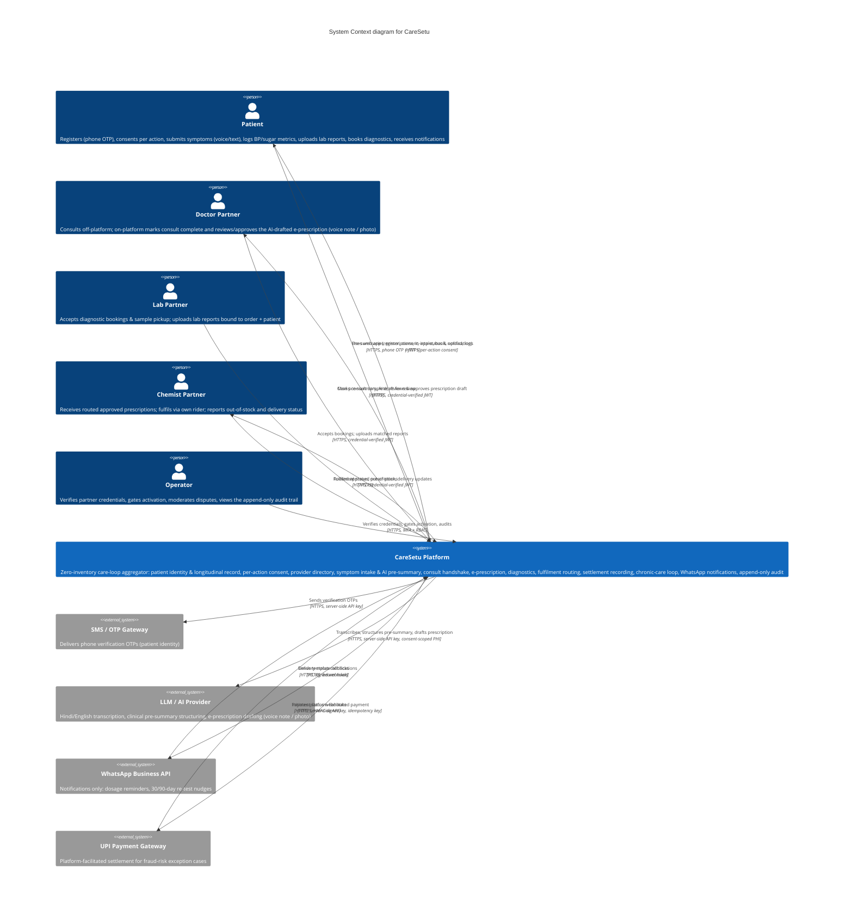

# System Context & External Architecture Document (Blackbox View)

**System Name:** CareSetu
**Document Version:** 1.0 (Baseline)
**Date:** 2026-08-07
**Architect:** Engineering / Architecture (derived from PRD v1.0)
**Upstream Inputs:** PRD v1.0 (`FEAT-xxx`, `NFR-xxx`) | RGD v1.0 | Conflict & Gap Report v1.0

---

## 1. System Boundary Definition & Objectives

**Scope statement.** The **CareSetu Platform** is a zero-inventory, pure-facilitator care-loop aggregator serving the Daltonganj beachhead (`REQ-002`, `REQ-008`). Everything that implements the product — patient & partner web apps (PWA), operator console, backend services (identity, per-action consent, longitudinal health record, provider directory, symptom intake & AI orchestration, consult handshake, e-prescription, diagnostics booking, fulfilment routing, settlement recording, chronic-care loop, WhatsApp notifications, append-only audit) and the platform's own data stores (longitudinal record, PHI object storage, audit log) — sits **inside** the blackbox. What crosses the perimeter is this document's subject; the internal decomposition is the `whitebox-arch` stage's job.

**Inside the boundary:** the CareSetu platform itself (all user-facing channels + backend + platform data stores).

**Outside the boundary (in scope at launch):**

- Five human actor types — Patient, Doctor Partner, Lab Partner, Chemist Partner, Operator.
- Four third-party systems — SMS/OTP gateway, LLM/AI provider, WhatsApp Business API, UPI payment gateway.
- Client-supplied boundary inputs: patient voice/text/photo uploads, lab report uploads, geolocation (browser) for distance-based routing, and per-action consent grants.

**Explicitly outside the boundary (carried forward, not built):** ABHA health-record integration (`REQ-038`, `[FUTURE]`), monetization/commission capture (`REQ-039`), native-app / WhatsApp-first patient channels (`REQ-040`, `[FUTURE]`), lab-report baseline parsing (`REQ-026`, deferred). WhatsApp carries **notifications only** at launch (`REQ-035`); no transaction or interaction occurs there.

**Primary integration goals:**

1. **Zero-inventory facilitation** — money and inventory never cross the boundary except the documented exception: platform-facilitated UPI settlement only on a fraud-risk signal, both parties opted in (`REQ-029`/`REQ-030`, `FEAT-016`, `RISK-001`). All other settlement is direct cash/UPI at the point of service, recorded as outcome only.
2. **Consent-scoped, minimal PHI egress** — only the intake/prescription context required for structuring or drafting crosses to the LLM provider, never the full longitudinal record; every PHI egress is gated by a recorded per-action consent (`FEAT-002`) and lands in the audit trail (`FEAT-020`).
3. **Notifications-only WhatsApp** — template-based egress; inbound callbacks are delivery-status only and must never trigger clinical workflows (`FEAT-019`).
4. **Phone-OTP patient identity** — baseline per `GAP-001`; the boundary accepts OTP-verified sessions with JWT delegation and per-action consent scoping (`FEAT-001`).
5. **Pure-facilitator posture** — regulated acts (consult, e-prescription, dispensing/delivery, lab testing) stay with licensed partners; the platform only verifies and displays credentials and orchestrates the loop (`REQ-005`).
6. **Cost floor** — total monthly operating + hosting + AI spend ≤ ₹2,000 at launch scale; external providers used on freemium/budget-bound tiers (`NFR-001`, `KPI-007`).

---

## 2. C4 Model - Level 1: System Context Diagram

---

## 3. External Actors Catalog

_(Human, machine, or administrative actors interacting with the system boundary)_

| Actor ID      | Actor Name      | Role & Responsibility                                                                                                                                                                                                                                                                                 | Interaction Channel                 | Security / Auth Protocol                                                                                                                       | Parent Traceability ID                                                                                                                         |
| :------------ | :-------------- | :---------------------------------------------------------------------------------------------------------------------------------------------------------------------------------------------------------------------------------------------------------------------------------------------------- | :---------------------------------- | :--------------------------------------------------------------------------------------------------------------------------------------------- | :--------------------------------------------------------------------------------------------------------------------------------------------- |
| **`ACT-001`** | Patient         | Registers & verifies identity; grants/revokes per-action consent; searches providers; submits voice/text symptoms; books diagnostics; uploads lab reports; logs BP/sugar metrics; decides on out-of-stock / delivery-failure; settles cash/UPI at point of service; views own record & access history | Web app (PWA, mobile-first) over 4G | Phone OTP verification (baseline `GAP-001`) + session JWT; RBAC = own record only; every share gated by recorded per-action consent            | `FEAT-001`, `FEAT-002`, `FEAT-003`, `FEAT-004`, `FEAT-006`, `FEAT-010`, `FEAT-011`, `FEAT-013`, `FEAT-016`, `FEAT-017`, `FEAT-018`, `FEAT-019` |
| **`ACT-002`** | Doctor Partner  | Consults off-platform (`REQ-004`); on-platform marks the consult complete (handshake) and reviews/approves the AI-drafted e-prescription from a voice note / photo, with final clinical authority                                                                                                     | Partner web app                     | Credential-verified account (`REQ-028` gating) + JWT; RBAC = own consult scope; e-prescription never issued without doctor approval            | `FEAT-008`, `FEAT-009`                                                                                                                         |
| **`ACT-003`** | Lab Partner     | Accepts diagnostic bookings & sample pickup; uploads lab reports bound to order + patient; settles at point of service                                                                                                                                                                                | Partner web app                     | Credential-verified account + JWT; RBAC = own orders scope; uploads matched via order-ID + patient confirmation (`GAP-004`/`GAP-008` baseline) | `FEAT-010`, `FEAT-011`, `FEAT-016`                                                                                                             |
| **`ACT-004`** | Chemist Partner | Receives routed approved prescriptions; fulfils via own rider; reports out-of-stock, partial fulfilment, delivery/pickup failures; settles cash/UPI on delivery                                                                                                                                       | Partner web app                     | Credential-verified account + JWT; RBAC = own orders scope                                                                                     | `FEAT-012`, `FEAT-013`, `FEAT-016`                                                                                                             |
| **`ACT-005`** | Operator        | Verifies partner credentials, gates activation, moderates disputes, views the append-only audit trail and consent lifecycle                                                                                                                                                                           | Operator console                    | MFA + RBAC = all records (read/moderation); every decision (`approve`/`reject`) audited                                                        | `FEAT-015`, `FEAT-020`                                                                                                                         |

---

## 4. External Systems & Third-Party Integration Matrix

_(All software systems, platforms, or APIs outside the blackbox perimeter)_

### 4.1 Integration Catalog

| System ID     | External System       | Primary Function                                                                                            | Integration Pattern                                                      | Data Format                             | Auth Protocol                                           | Rate Limits / SLA                                                                                        | Traceability                                             |
| :------------ | :-------------------- | :---------------------------------------------------------------------------------------------------------- | :----------------------------------------------------------------------- | :-------------------------------------- | :------------------------------------------------------ | :------------------------------------------------------------------------------------------------------- | :------------------------------------------------------- |
| **`EXT-001`** | SMS / OTP Gateway     | Deliver phone-verification OTPs for patient identity                                                        | Outbound synchronous REST; optional delivery receipts (non-load-bearing) | JSON (+ text message)                   | Server-side API key                                     | Best-effort (no SLA per `NFR-004`); ~1 OTP per registration/login attempt; in-app resend cooldown ≥ 60 s | `FEAT-001`, `NFR-002`                                    |
| **`EXT-002`** | LLM / AI Provider     | Hindi/English voice-to-text, clinical pre-summary structuring, e-prescription drafting (voice note / photo) | Outbound synchronous REST (long-running); server-side orchestration      | JSON + audio/image uploads              | Server-side API key; freemium tier                      | Freemium quota; monthly token/₹ budget within `NFR-001` (≤ ₹2,000/mo total); timeout ≤ 30 s              | `FEAT-006`, `FEAT-007`, `FEAT-009`, `NFR-001`, `NFR-002` |
| **`EXT-003`** | WhatsApp Business API | Notifications only — dosage reminders, 30/90-day re-test nudges in English/Hindi                            | Outbound template messaging + inbound delivery-status callbacks          | JSON (template-based, per WhatsApp/DLT) | Bearer token / API key + webhook signature verification | WhatsApp business-tier rate limits; best-effort delivery (`NFR-004`)                                     | `FEAT-019`, `NFR-002`                                    |
| **`EXT-004`** | UPI Payment Gateway   | Platform-facilitated settlement for fraud-risk exception cases (`FEAT-016` exception path)                  | Bi-directional — outbound initiation REST + inbound status webhooks      | JSON                                    | Server-side API key + HMAC webhook signature            | Partner quotas; best-effort; fallback to direct cash/UPI if unavailable                                  | `FEAT-016`, `NFR-002`                                    |

### 4.2 Integration Specifications (Detailed Contracts)

#### System Integration: `EXT-001` (SMS / OTP Gateway)

- **Ingress / Egress Direction:** Egress only (platform → provider). Optional inbound delivery receipts; not load-bearing at launch.
- **Network Protocol:** `HTTPS (TLS 1.2+)`, synchronous REST, `JSON`.
- **Data Payload Schema:**
  - Request: `{ "phone_e164": "+91…", "template": "caresetu_otp", "params": { "otp": "123456", "ttl_min": 5 } }`
  - Response: `{ "request_id": "…", "status": "queued" }`
- **Error & Retry Behavior:** On HTTP 5xx / rate-limit → exponential backoff, max 3 retries; persistent failure logged (`patient_auth_failed`); patient may re-request via an in-app resend gate (cooldown ≥ 60 s). OTP validity 5 minutes, single-use. OTP values are hashed at rest and never logged.
- **Security & Verification:** Server-side API key from environment (never client-exposed); transport TLS; the only PII crossing is the phone number; OTP generation and verification stays server-side (`GAP-001` baseline = phone OTP).

#### System Integration: `EXT-002` (LLM / AI Provider)

- **Ingress / Egress Direction:** Egress only (platform → provider), synchronous long-running calls with server-side orchestration; no inbound webhooks.
- **Network Protocol:** `HTTPS (TLS 1.2+)`, REST, `JSON`, multipart upload for audio / photo.
- **Data Payload Schema:**
  - `transcribe`: `{ "audio_ref", "language": "hi|en", "mode": "voice" }` → `{ "transcript", "confidence", "language" }`
  - `structure`: `{ "transcript", "source": "voice|text" }` → `{ "chief_complaints": [], "symptoms": [], "duration", "confidence" }`
  - `draft_rx`: `{ "doctor_input_ref": "voice_note|photo", "pre_summary_ref", "patient_history_summary" }` → `{ "rx_items": [ { "name", "dose", "duration" } ], "confidence" }`
- **Error & Retry Behavior:** HTTP 5xx / 429 → exponential backoff, max 3 retries; per-call timeout ≤ 30 s; on timeout, repeated failure, or low structuring confidence → degrade to the `AMB-006` baseline: flag **"low confidence — verify"** and force doctor review (`FEAT-007`, `FEAT-009`); never present unverified output as final. A Hindi-voice feasibility spike precedes launch (`RISK-EVAL-006`).
- **Security & Verification:** **PHI minimization** — send only the intake/prescription context required, never the full longitudinal record; reference patient data by pseudonymous refs where possible; server-side API key; every PHI egress gated by recorded consent and written to the append-only audit trail (`FEAT-002`, `FEAT-020`). Freemium tier + hard token/₹ budget enforced (`NFR-001`, `NFR-COST-001`).

#### System Integration: `EXT-003` (WhatsApp Business API)

- **Ingress / Egress Direction:** Bi-directional — egress template notifications (platform → provider); ingress delivery-status callbacks (provider → platform).
- **Network Protocol:** `HTTPS (TLS 1.2+)`, REST, `JSON`, template-based messaging (WhatsApp template + India DLT requirements).
- **Data Payload Schema:**
  - Send: `{ "to": "+91…", "template": "dosage_reminder|retest_30|retest_90", "language": "hi|en", "params": { … } }` → `{ "message_id": "…" }`
  - Callback: `{ "message_id": "…", "status": "sent|delivered|read|failed", "error_code": "…" }`
- **Error & Retry Behavior:** Delivery failure → logged (`notification_failed`); retried at the next scheduled slot; repeated failure prompts the patient to confirm their number (`FEAT-019` edge case). **Notifications only** — inbound non-template messages must never trigger clinical or transactional workflows (`REQ-035`).
- **Security & Verification:** Bearer token / API key server-side; inbound callback signature verification (`NFR-SEC-005`); only templated content crosses; language follows the patient's `REQ-006` setting; notification sends recorded in the audit trail.

#### System Integration: `EXT-004` (UPI Payment Gateway)

- **Ingress / Egress Direction:** Bi-directional — egress initiation (platform → provider); ingress status webhooks (provider → platform). Used only on the `FEAT-016` fraud-risk exception path (`AMB-004`/`CFL-001` baseline: both parties opt in + risk signal); all other settlement is direct cash/UPI recorded as outcome only.
- **Network Protocol:** `HTTPS (TLS 1.2+)`, REST, `JSON`.
- **Data Payload Schema:**
  - Initiate: `{ "order_ref", "amount_paise", "customer_upi", "purpose": "fraud_risk_facilitation" }` → `{ "payment_ref", "upi_intent", "status": "initiated" }`
  - Webhook: `{ "payment_ref", "order_ref", "status": "success|failed", "amount_paise", "utr" }`
- **Error & Retry Behavior:** Idempotency key per order (no double charge); webhook replay-safe via dedupe on `payment_ref`; on gateway unavailable / timeout → fall back to direct cash/UPI at point of service with a risk note (PRD §5.2); reconciliation via status polling + webhooks; platform holds no funds and processes no refunds (`REQ-036`).
- **Security & Verification:** Server-side API key; HMAC signature verification on every webhook (`NFR-SEC-005`); platform records only the settlement outcome (`GAP-010` baseline: receipts are partner-issued); `settlement_recorded` + `platform_payment_initiated` events written to the audit trail.

---

## 5. Non-Functional Boundary Rules & Edge Protection

_(System-wide perimeter constraints derived from `NFR-xxx`)_

### 5.1 Derived Perimeter Rules

- **`NFR-SEC-001` Transport Security at the Boundary:** Every external channel — user web apps, partner web apps, operator console, and all four third-party integrations — uses `TLS 1.2+` in transit; all PHI encrypted at rest; no cleartext PII/PHI crosses any wire (`NFR-002`).
- **`NFR-SEC-002` Identity & Authentication at the Boundary:** Patients authenticate via phone OTP + session JWT (baseline `GAP-001`); partners authenticate with credential-verified accounts gated by `REQ-028`; operator access requires MFA. Re-registration with an existing phone resolves to the existing identity, never a duplicate (`FEAT-001`).
- **`NFR-SEC-003` Authorization (RBAC) at the Boundary:** Role-based access enforced on every boundary request — Patient (own record only), Partner (own orders/reports/prescriptions), Operator (all records, moderation, audit); denied cross-role access attempts are denied and written to the audit log (`FEAT-003`, `NFR-002`).
- **`NFR-SEC-004` Ingress Filtering & Abuse Protection:** WAF/edge rate-limiting (e.g., on OTP, auth, and intake endpoints), DDoS mitigation, request validation (size/content-type/schema), and upload scanning; report uploads matched to order + patient before filing (`RISK-002` mitigation) (`NFR-002`, `FEAT-011`).
- **`NFR-SEC-005` Webhook Verification:** All inbound callbacks (WhatsApp delivery status, UPI payment status) are signature/HMAC-verified against provider secrets before acceptance; verified events are idempotent and replayed safely (`NFR-002`, `FEAT-016`, `FEAT-019`).
- **`NFR-SEC-006` Consent-Gated, Minimal PHI Egress:** No PHI leaves the boundary without a recorded per-action consent (`FEAT-002`); egress to the LLM carries only the required intake/prescription context (never the full record); every PHI egress is captured in the append-only audit trail (`FEAT-020`, `NFR-002`).
- **`NFR-PERF-001` Boundary Latency & Page Budget:** Initial page load ≤ 5 s on a mid-tier 4G device; page weight ≤ 1.5 MB; no low-bandwidth optimization below this baseline (`NFR-003`, `AMB-001`).
- **`NFR-PERF-002` Upload Resilience:** Voice intake upload works at ≥ 1 Mbps downlink; client auto-retry up to 3 times with backoff; unusable audio prompts re-record, never silent proceed (`NFR-003`, `FEAT-006`).
- **`NFR-PERF-003` External-Call Timeouts & Retries:** Bounded timeouts on all external providers (SMS/WhatsApp/UPI ≤ 10 s; LLM ≤ 30 s), exponential backoff with capped retries, and graceful degradation — an external provider failure must never block the core care loop (`NFR-003`, `NFR-004`).
- **`NFR-PERF-004` Availability & Durability Floor:** Best-effort availability with no uptime SLA (`NFR-004`); durability floor at the boundary: backups ≥ daily (RPO ≤ 24 h) and restore validation ≥ monthly, protecting the longitudinal record (`GAP-012`); external integrations are async/non-blocking for non-critical egress so their outages don't violate the floor (`RISK-EVAL-005`).
- **`NFR-COST-001` Boundary Cost Budget (domain-specific extension of the `NFR-SEC/PERF/COMP` families):** Total monthly operating + hosting + AI spend ≤ ₹2,000 at launch scale (`KPI-007`); SMS, WhatsApp, and LLM usage bound to freemium tiers and per-message/token budgets with alerts; no paid proprietary frameworks at launch (`NFR-001`).
- **`NFR-COMP-001` Data Residency & Localization:** Longitudinal health data resides/located in India; external transfers minimize PHI; data-localization decisions per DPDP Act 2023 baseline, with breach-notification and localization specifics **carried forward** under open `GAP-013` (`NFR-002`, `NFR-D02`).
- **`NFR-COMP-002` Consent Lifecycle Across the Boundary:** Consent versioning, withdrawal flow, and consequences of revocation (incl. handling of previously shared data) follow the DPDP baseline — open under `GAP-005`/`GAP-013`; revocation stops all future sharing with the counterparty and is recorded (`FEAT-002`, `NFR-D02`).

### 5.2 Perimeter Rules Carried Forward (open decisions)

| Open Item (PRD §7.1)              | Boundary Implication                                                                                                               | Status                             |
| :-------------------------------- | :--------------------------------------------------------------------------------------------------------------------------------- | :--------------------------------- |
| `CFL-002` / `RISK-EVAL-003`       | LLM egress for e-prescription drafting (AI as drafting assistant under doctor authority) needs compliance sign-off before reliance | Baseline approved; carried forward |
| `GAP-001`                         | Patient identity strength at the boundary (OTP vs. stronger) — OTP is the baseline                                                 | Baseline approved; carried forward |
| `GAP-004` / `GAP-008`             | Report→order→patient matching mechanism — order-ID binding + patient confirmation is the baseline                                  | Baseline approved; carried forward |
| `GAP-010`                         | Payment capture/receipt/reconciliation detail — platform records outcome; partner issues receipts                                  | Baseline approved; carried forward |
| `GAP-011` / `GAP-005` / `GAP-013` | Audit-trail retention period; data retention/deletion; consent lifecycle & data-localization specifics                             | Carried forward (unresolved)       |
| `AMB-006` / `RISK-EVAL-006`       | Hindi ASR accuracy threshold; low-confidence fallback = forced doctor review; feasibility spike before launch                      | Baseline approved; carried forward |
| `AMB-004` / `CFL-001`             | Fraud-risk trigger for the `EXT-004` facilitated-payment path                                                                      | Baseline approved; carried forward |
| `REQ-038` (ABHA)                  | No boundary integration at launch                                                                                                  | Out of scope / future              |

---

## 6. Boundary Traceability Matrix

| External Interface / Actor ID | PRD Feature / NFR ID                                       | System Boundary Security Requirement                                             | Status  |
| :---------------------------- | :--------------------------------------------------------- | :------------------------------------------------------------------------------- | :------ |
| `ACT-001` (Patient)           | `FEAT-001`, `FEAT-002`, `FEAT-003`, `FEAT-018`, `FEAT-019` | Phone OTP + JWT; TLS 1.2+; per-action consent; RBAC own record                   | Defined |
| `ACT-002` (Doctor)            | `FEAT-008`, `FEAT-009`                                     | Credential-verified JWT; TLS 1.2+; approval gate on issuance                     | Defined |
| `ACT-003` (Lab)               | `FEAT-010`, `FEAT-011`                                     | Credential-verified JWT; order-ID + patient match before filing                  | Defined |
| `ACT-004` (Chemist)           | `FEAT-012`, `FEAT-013`                                     | Credential-verified JWT; RBAC own orders                                         | Defined |
| `ACT-005` (Operator)          | `FEAT-015`, `FEAT-020`                                     | MFA; RBAC all records; every decision audited                                    | Defined |
| `EXT-001` (SMS/OTP)           | `FEAT-001`, `NFR-002`                                      | TLS 1.2+; server-side API key; OTP hashed, never logged                          | Defined |
| `EXT-002` (LLM/AI)            | `FEAT-006`, `FEAT-007`, `FEAT-009`, `NFR-001`, `NFR-002`   | TLS 1.2+; API key; PHI-minimized, consent-gated, audited egress; freemium budget | Defined |
| `EXT-003` (WhatsApp)          | `FEAT-019`, `REQ-035`, `NFR-002`                           | TLS 1.2+; bearer token; signed webhooks; notifications only                      | Defined |
| `EXT-004` (UPI GW)            | `FEAT-016`, `NFR-002`                                      | TLS 1.2+; API key; HMAC-signed webhooks; idempotency; no fund holding            | Defined |
